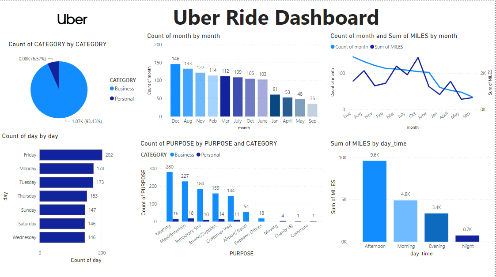

---

# 🚗 Uber Ride Data Analysis Project

A data analytics project exploring Uber ride usage patterns to derive meaningful business insights and actionable recommendations using Python and interactive dashboard visualizations.

---

## 📌 Project Overview

This project analyzes Uber ride data to explore:

* Usage patterns across months, days, and times.
* Trip purposes and categories (business vs. personal).
* Trip durations, mileage trends, and peak hours.

A Power BI dashboard and detailed documentation support the insights, helping stakeholders make data-driven decisions.

---

## 📁 Files in the Repository

| File Name                                                         | Description                                                               |
| ----------------------------------------------------------------- | ------------------------------------------------------------------------- |
| `UberDataset.csv`                                                 | Raw dataset containing Uber ride records.                                 |
| `UberDatasetCleaned.csv`                                          | Cleaned and preprocessed dataset.                                         |
| `Dashboard.png`                                                   | Snapshot of the Power BI dashboard visualization.                         |
| `Uber_Rides_Data_Analysis_Documentation_and_Recommendations.docx` | Full project documentation with methodology and business recommendations. |

---

## 🧪 Analysis Workflow

### 🔹 1. Importing Libraries

* Libraries: `pandas`, `numpy`, `matplotlib`, `seaborn`

### 🔹 2. Dataset Loading

* Previewed the first 10 rows of the Uber dataset to understand structure.

### 🔹 3. Data Exploration

* Summary statistics, data types, null values, and duplicate rows identified.

### 🔹 4. Missing Value Handling

* Forward fill used for the `PURPOSE` column.
* `month` and `year` columns filled using mode.

### 🔹 5. Date & Time Processing

* Converted `START_DATE` and `END_DATE` to datetime objects.
* Extracted:

  * Date
  * Time
  * Month
  * Year
  * Hour
  * Minute

### 🔹 6. Trip Duration Calculation

* Calculated trip duration in minutes.

### 🔹 7. Visual Analysis

* Created correlation heatmaps, count plots, bar plots, and distribution plots.

### 🔹 8. Data Export

* Saved the cleaned DataFrame as `UberDatasetCleaned.csv`.

---

## 📊 Dashboard Highlights

<details>
<summary>Click to view key visuals</summary>



</details>

### Key Metrics Visualized:

* 📅 **Rides per Month**: Trends in monthly ride volume.
* ⏰ **Rides by Day & Time**: Peak ride hours and weekdays.
* 🧭 **Purpose of Rides**: Business vs. Personal breakdown.
* 🛣 **Miles Traveled**: Total distance by time and category.
* 🎯 **Category Usage**: High-level overview of ride categories.

---

## 📌 Key Recommendations

1. 📆 Optimize ride availability during high-demand months.
2. 🧠 Tailor marketing efforts based on ride purposes.
3. ⌚ Improve ride management during peak times.
4. ⏱ Monitor and reduce longer trip durations.
5. 🏷 Offer promotions in personal ride segments.
6. 🌐 Analyze high-mileage routes for operational efficiency.
7. 📝 Incorporate customer feedback for service improvements.
8. 🧑‍✈️ Improve driver training and route efficiency.

---

## 💻 How to Use

1. **Load CSV files** using pandas:

   * `UberDataset.csv` (raw)
   * `UberDatasetCleaned.csv` (cleaned)

2. **Explore Analysis**:

   * Run the Jupyter Notebook (`Uber_Rides_Data_Analysis.ipynb`).
   * View visualizations and preprocessing steps.

3. **Review Documentation**:

   * Read the DOCX file for step-by-step analysis & recommendations.

4. **View Dashboard**:

   * Open `Dashboard.png` or create an interactive version in Power BI/Tableau.

---


---

## 🛠 Setup Instructions

### 🔧 Clone the Repository

```bash
git clone https://github.com/sumit3162/Uber-Rides-Data-Analysis.git
cd Uber-Rides-Data-Analysis
```

### 📦 Install Dependencies

```bash
pip install -r requirements.txt
```

### 🚀 Run the Analysis

```bash
jupyter notebook Uber_Rides_Data_Analysis.ipynb
```

### 📄 Read Documentation

* Open `Uber_Rides_Data_Analysis_Documentation_and_Recommendations.docx` for a deep dive.

---

Let me know if you'd like:

* A Power BI `.pbix` file template
* A video walkthrough script
* Deployment via Streamlit or Flask